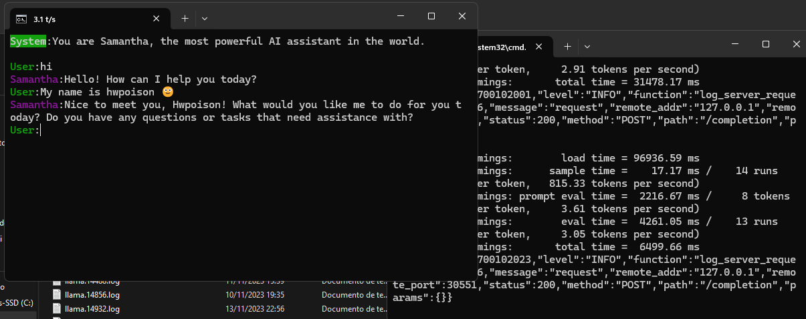

# Llama.cpp Server Terminal Client

This is a lightweight terminal interface for chat with llama.cpp server following an outline of a script with actors and chatguards for preserve the experience of a chat, also you can use commands for manipulate the conversation flow. Supports personal prompts and prompts templates. It is compilable for Windows and Linux.

*llama.cpp server:* https://github.com/ggerganov/llama.cpp/tree/master/examples/server

## How to Use
#### Configuration files
**my_prompts.json**  contains all prompts setted with system prompt, actors and names.

 

**params.json**  contains all definitions for prompt adjustements and prompt templates styles.

#### Execultable Arguments:
-  --my-prompt *prompt name*            (default: default)
-  --param-profile* profile name*       (default: default)
-  --prompt-template *prompt template*  (default: empty)
-  --no-chat-guards: Disable the chat guards (default: false)
-  --ip <ip address>                    (default: 127.0.0.1)
-  --port <port>                        (default: 8080)

The chat guards adds the prompt template tokens into stop words array.

#### Command support:
To input a command, simply insert `/*command*` followed by the desired command.

##### Command List:
- **narrator:** Lets to narrator generate a narration.
- **director:** Switch to director mode input.
- **actor:** Create a new character or use an existent into convesation and lets it talks. (ex: /actor Einstein).
- **as:** Pretend to be an actor and prompt it. (ex: /as Einstein)
- **talkto:** Talk to a determinated character. It will swtich the current talking actor. (ex: /talkto Monica)

 

- **retry / r:** Retry the last completion.
- **continue:** Continue the completion without intervention. (The assistant will continue talking)
- **undolast:** Undo only the last completion.
- **undo / u:** Undo the last completion and user input.

 
  
- **save (chatname):** Save the chat. (without extension)
- **load (chatname):** Load a previous saved chat.
- **redraw:** Redraw the chat content.
- **reset:** Reset the entire chat.
- **quit / q:** Exit the program.
- **lprompt:** Print the current prompt.
- **lparams:** Print the current parameters.
- **lactors:** Print current actors.
- **rparams** Reload current parameter profile.
- **rtemplate** Reload current template profile.
- **stemplate (template name)** Load and set prompt template in runtime.

### Instructions to build

    git submodule init
    git submodule update
    make

## **Tested on**

<table><tbody><tr><td>Windows</td><td>GCC</td><td>gcc (x86_64-posix-seh-rev1, Built by MinGW-Builds project) 13.1.0</td></tr><tr><td>Linux</td><td>GCC</td><td>gcc (Ubuntu 9.4.0-1ubuntu1~20.04.1) 9.4.0</td></tr></tbody></table>
